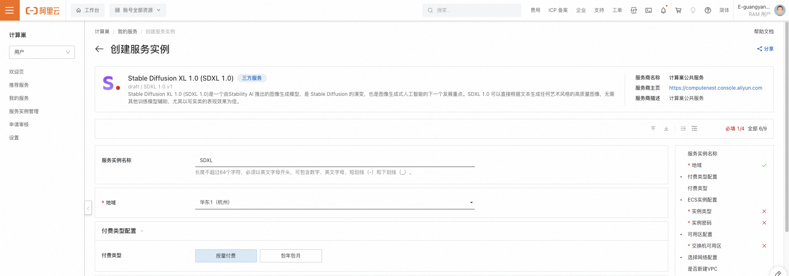
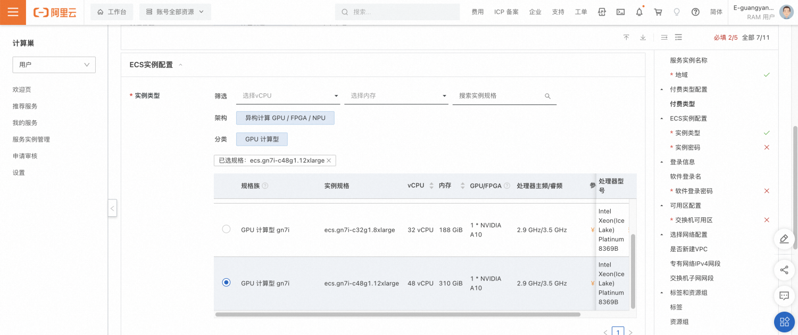
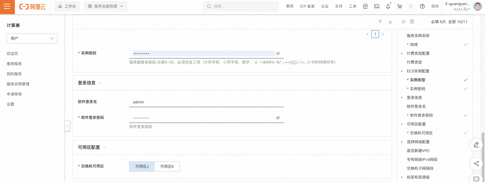
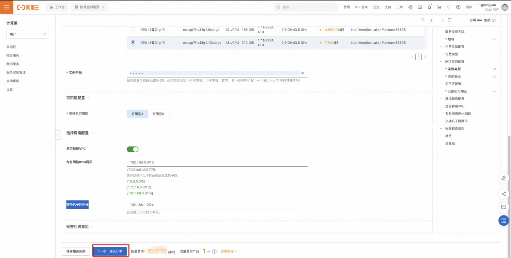
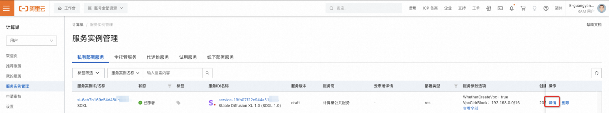
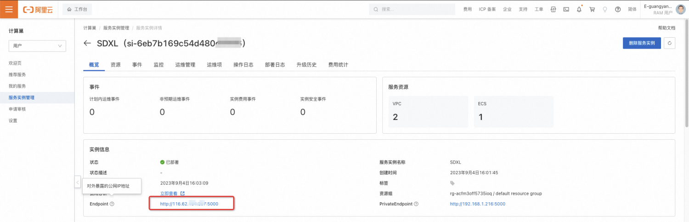
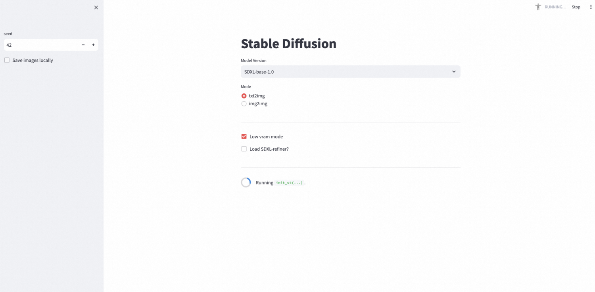
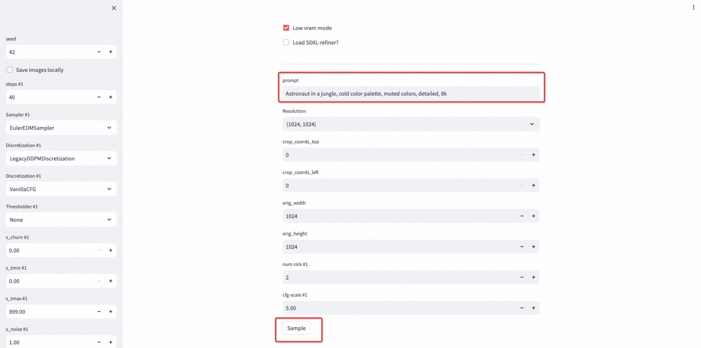
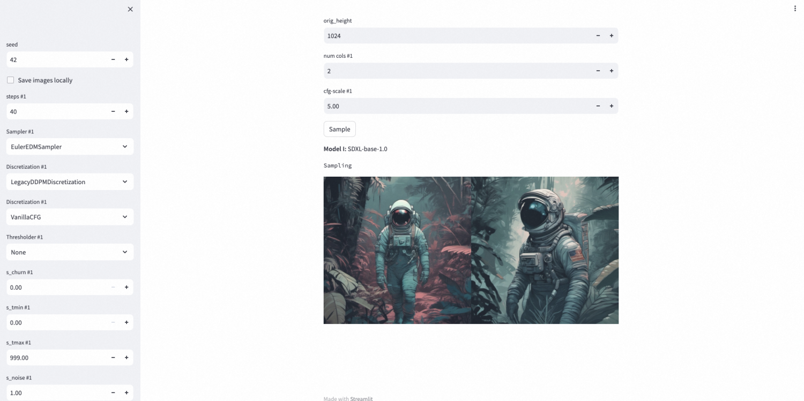

<h1> Overview </h1>

Stable Diffusion XL 1.0 (SDXL 1.0) is an image generation model launched by Stability AI. It is the evolution of Stable Diffusion and the next development focus of image generation artificial intelligence. SDXL 1.0 can generate high-quality images of any artistic style directly from the text without the assistance of other training models, especially for realistic performance.
This topic describes how to activate the SDXL 1.0 service on the computing nest, as well as the deployment process and usage instructions. You can quickly deploy SDXL 1.0 services on the computing nest to play with large model text and graph. 

<h1> Deployment process </h1>

<h2>0. Preparations </h2>

 Before you start using it, you need an Alibaba Cloud account to access and create resources such as ECS and VPC. 

<ul>
<li> If you use a personal account, you can directly create a service instance. </li>
<li> If you use a RAM user to create a service instance and this is the first time to use the Alibaba Cloud computing nest, you need to add the corresponding resource permissions to the account of the RAM user before creating the service instance. For more information about how to add RAM permissions, see <a href = "https://help.aliyun.com/document_detail/121945.html"> Authorize RAM users </a>. The required permissions are shown in the following table. </li>
</ul>

<table>
<thead>
<tr>
<th> Permission policy name </th>
<th> Remarks </th>
</tr>
</thead>
<tbody>
<tr>
<td>AliyunECSFullAccess</td>
<td> Permissions to manage ECS </td>
</tr>
<tr>
<td>AliyunVPCFullAccess</td>
<td> Permissions for managing VPC networks </td>
</tr>
<tr>
<td>AliyunROSFullAccess</td>
<td> Manage permissions for Resource Orchestration Services (ROS) </td>
</tr>
<tr>
<td>AliyunComputeNestUserFullAccess</td>
<td> Manage user-side permissions for the compute nest service (ComputeNest) </td>
</tr>
</tbody>
</table>

<h2>1. Deployment portal </h2>

 You can search for "Stable Diffusion XL 1.0 (SDXL 1.0)" in the Alibaba Cloud computing nest to find service information and deployment links. 

<h2>2. Create SDXL 1.0 service </h2>

<h4>2.1 parameter list </h4>

 When you create a service instance, you need to configure the parameter list of the service instance information, as follows. 

<table>
<thead>
<tr>
<th> Parameter group </th>
<th> Parameter item </th>
<th> Example </th>
<th> Description </th>
</tr>
</thead>
<tbody>
<tr>
<td> Service instance name </td>
<td>N/A</td>
<td>SDXL</td>
<td> Name of the instance </td>
</tr>
<tr>
<td> Region </td>
<td>N/A</td>
<td> China (Hangzhou)</td>
<td> Select the region of the service instance. We recommend that you select the region nearby to obtain better network latency. </td>
</tr>
<tr>
<td> Payment type configuration </td>
<td> Payment type </td>
<td> Pay-As-You-Go </td>
<td> The payment type of ECS. We recommend that you select Pay-As-You-Go to release resources more flexibly. </td>
</tr>
<tr>
<td>ECS instance configuration </td>
<td> Instance type </td>
<td>ecs.gn7i-c16g1.4xlarge</td>
<td> Three specifications are currently supported: ecs.gn7i-c16g1.4xlarge, ecs.gn7i-c32g1.8xlarge, and ecs.gn7i-c48g1.12xlarge</td>
</tr>
<tr>
<td>ECS instance configuration </td>
<td> Instance password </td>
<td>**</td>
<td> Set the instance password. Length 8\~ 30 characters, must contain three items (uppercase letters, lowercase letters, numbers, special symbols). </td>
</tr>
<tr>
<td> Availability Zone Configuration </td>
<td> Switch zone </td>
<td> Availability Zone I</td>
<td> Different available regions under the region. </td>
</tr>
<tr>
<td> Select network configuration </td>
<td> Whether to create a new VPC</td>
<td> Yes </td>
<td> If Yes is selected, the computing nest will automatically create a new VPC and VSwitch in the region and zone. If No is selected, select the existing VPC and VSwitch. </td>
</tr>
<tr>
<td> Select network configuration </td>
<td> VPC instance ID</td>
<td>vpc-xxx</td>
<td> According to the actual situation, select the ID of the VPC. </td>
</tr>
<tr>
<td> Select network configuration </td>
<td> Switch instance ID</td>
<td>vsw-xxx</td>
<td> Select the switch ID as appropriate. If the switch cannot be found, try to switch the region and zone. </td>
</tr>
</tbody>
</table>

<h4>2.2 steps </h4>

 Create a service instance according to the following steps, refer to the following figure:

<ul>
<li> Create an instance name, as shown in the following figure: SDXL;</li>
<li> Select a region, such as China (Hangzhou) in the following figure. </li>
</ul>

<ul>
<li> Select the instance type, as shown in the following figure, select ecs.gn7i-c48g1.12xlarge. </li>
</ul>

<ul>
<li> Configure the password of the instance. </li>
<li> Configure the login name and password of the software;</li>
<li> Select the deployment area, as shown in "Availability Zone J" in the figure below;</li>
</ul>

<ul>
<li> Select to create a VPC. You can use the default values for VPC IPv4 CIDR block and VSwitch subnet CIDR block. </li>
<li> Click Next to enter the confirmation order page;</li>
</ul>

<ul>
<li> Confirm the service instance information, read and agree to the Computing Nest Service Agreement, and click Create Now to create a service instance.
<h2>3. Use the SDXL 1.0 service </h2></li>
</ul>

<h4> View service instances 3.1 </h4>

<ul>
After the <li> service instance is successfully created, the deployment time takes about 2 minutes. After the deployment is complete, the corresponding service instance is displayed on the page, as shown in the following figure. View the details of the service instance;</li>
</ul>

<ul>
<li> In the instance information section, you can see the Endpoint field, that is, the service address exposed to the outside. </li>
</ul>

<h4>3.2 access via browser </h4>

<ul>
<li> After clicking the service address, you need to enter the user name and password of the software. After the verification passes, you will jump to a new page. By default, the SDXL 1.0 model is selected. It is recommended that you keep the "Low vram mode" selection to prevent insufficient memory from affecting the operation. The initialization process takes about 2 minutes. </li>
</ul>

<ul>
<li> After the initialization is completed, a series of parameters will be displayed. You can use prompt to describe the picture to be generated. Click Sample to start generating. </li>
</ul>

<ul>
<li> After the execution is complete, you can view the resulting image. </li>
</ul>

