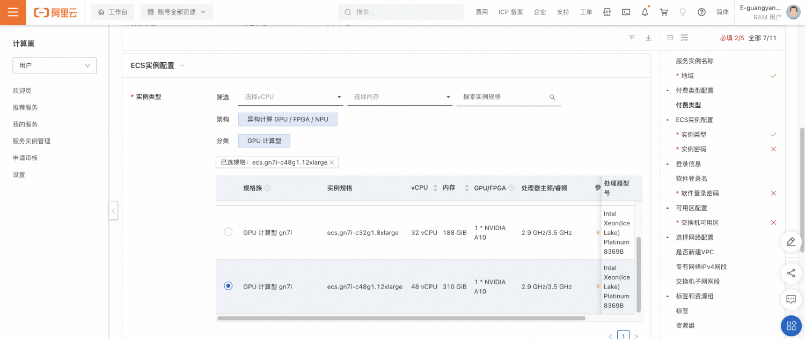
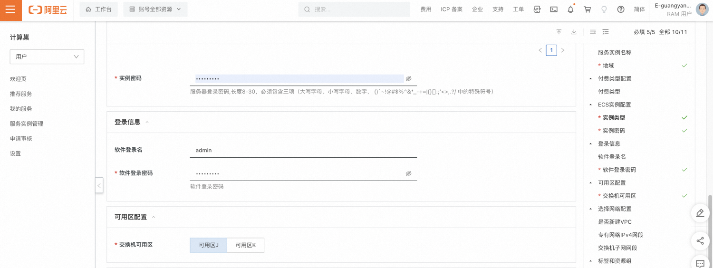
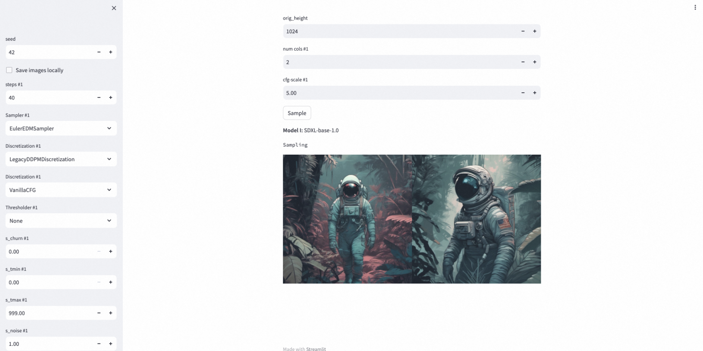

# 概述
Stable Diffusion XL 1.0 (SDXL 1.0)是一个由Stability AI 推出的图像生成模型，是 Stable Diffusion 的演变，也是图像生成式人工智能的下一个发展重点。SDXL 1.0 可以直接根据文本生成任何艺术风格的高质量图像，无需其他训练模型辅助，尤其以写实类的表现效果为佳。
本文向您介绍如何开通计算巢上的SDXL 1.0服务，以及部署流程和使用说明。您可以在计算巢上快速部署SDXL 1.0服务，玩转大模型文生图、图生图。
# 部署流程
## 0.准备工作
在正式开始使用前，您需要一个阿里云账号，对ECS、VPC等资源进行访问和创建操作。

- 若您使用个人账号，可以直接创建服务实例；
- 若您使用RAM用户创建服务实例，且是第一次使用阿里云计算巢，需要在创建服务实例前，对使用的RAM用户的账号添加相应资源的权限。添加RAM权限的详细操作，请参见 [为RAM用户授权](https://help.aliyun.com/document_detail/121945.html) 。所需权限如下表所示。

| 权限策略名称 | 备注 |
| --- | --- |
| AliyunECSFullAccess | 管理云服务器服务（ECS）的权限 |
| AliyunVPCFullAccess | 管理专有网络（VPC）的权限 |
| AliyunROSFullAccess | 管理资源编排服务（ROS）的权限 |
| AliyunComputeNestUserFullAccess | 管理计算巢服务（ComputeNest）的用户侧权限 |

## 1.部署入口
您可以在阿里云计算巢搜索“Stable Diffusion XL 1.0 (SDXL 1.0)”，以找到服务信息及部署链接。
## 2.创建SDXL 1.0服务
#### 2.1 参数列表
您在创建服务实例的过程中，需要配置服务实例信息的参数列表，具体如下。

| 参数组 | 参数项 | 示例 | 说明 |
| --- | --- | --- | --- |
| 服务实例名称 | N/A | SDXL | 实例的名称 |
| 地域 | N/A | 华东1（杭州） | 选中服务实例的地域，建议就近选中，以获取更好的网络延时。 |
| 付费类型配置 | 付费类型 | 按量付费 | ECS的付费类型，建议选择按量付费以便更灵活的释放资源。 |
| ECS实例配置 | 实例类型 | ecs.gn7i-c16g1.4xlarge | 当前支持三种规格：ecs.gn7i-c16g1.4xlarge、ecs.gn7i-c32g1.8xlarge、ecs.gn7i-c48g1.12xlarge |
| ECS实例配置 | 实例密码 | ** | 设置实例密码。长度 8\~30个字符，必须包含三项（大写字母、小写字母、数字、特殊符号）。 |
| 可用区配置 | 交换机可用区 | 可用区I | 地域下的不同可用区域。 |
| 选择网络配置 | 是否新建VPC | 是 | 如果选择是，计算巢会自动在该地域及可用区创建新的专有网络和交换机；如果选择否，请选择已有的专有网络和交换机。 |
| 选择网络配置 | 专有网络VPC实例ID | vpc-xxx | 按实际情况，选择专有网络的ID。 |
| 选择网络配置 | 交换机实例ID | vsw-xxx | 按实际情况，选择交换机ID。若找不到交换机, 可尝试切换地域和可用区。 |

#### 2.2 具体步骤
创建服务实例按照如下步骤进行，参考下图：

- 创建实例名称，如下图中“SDXL”；
- 选择地域，如下图中“华东1（杭州）”；

- 选择实例类型，如下图选择“ecs.gn7i-c48g1.12xlarge”；

- 配置实例的密码；
- 配置软件的登录名及密码；
- 选择部署区域，如下图中“可用区J”；

- 选择新建VPC，“专有网络IPv4网段”和“交换机子网网段”可使用默认值；
- 点击下一步，进入确认订单页面；

- 确认服务实例信息，阅读并同意《计算巢服务协议》后，点击“立刻创建”创建服务实例。
## 3.使用SDXL 1.0服务
#### 3.1 查看服务实例

- 服务实例创建成功后，部署时间大约需要2分钟。部署完成后，页面上可以看到对应的服务实例，如下图。查看该服务实例详情；

- 在实例信息部分，可以看到Endpoint字段，即为对外暴露的服务地址；

#### 3.2 通过浏览器访问

- 点击该服务地址后，需要输入软件的用户名和密码，验证通过后会跳转到新的页面。默认选择SDXL 1.0模型，文生图类型。建议您保留“Low vram mode”选择，以防止内存不足影响运行。初始化过程需要大概2分钟。

- 初始化完成后，会显示一系列参数，您可以通过prompt来描述需要生成的图片，点击Sample开始生成。

- 执行完成后，可以查看生成的图片。

